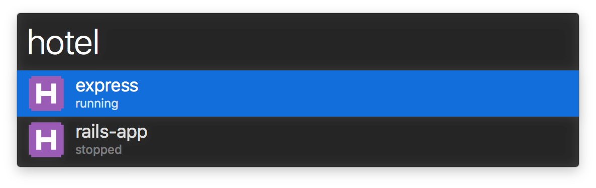

# alfred-hotel

> Alfred 3 workflow that allow you to start, open and stop [Hotel](https://github.com/typicode/hotel) apps.




## Requirements

- [Node.js](https://nodejs.org) >= 4.x
- [Hotel](https://github.com/typicode/hotel)
- Alfred [Powerpack](https://www.alfredapp.com/powerpack/)


## Install

```shell
$ npm install -g alfred-hotel
```


## Usage

In Alfred, type `hotel` to list all [Hotel](https://github.com/typicode/hotel) apps, press <kbd>Space</kbd> to search through list.

With selected app you can:

- <kbd>Enter</kbd> to start and open app in default browser (http://example.dev)
- <kbd>Alt</kbd> + <kbd>Enter</kbd> to open app without local domain (http://127.0.0.1:50409)
- <kbd>Command</kbd> + <kbd>Enter</kbd> to stop selected app
- <kbd>Shift</kbd> to preview url in quicklook


## License

[MIT](LICENSE.md) © [John Grishin](http://johngrish.in)
